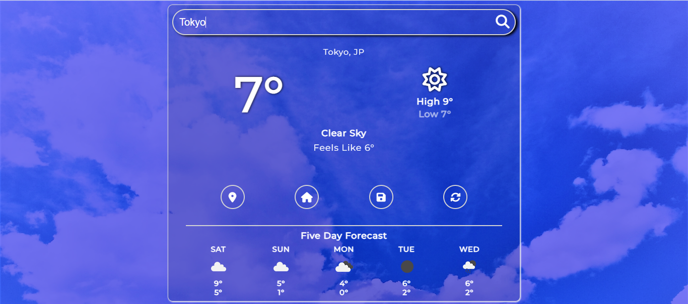
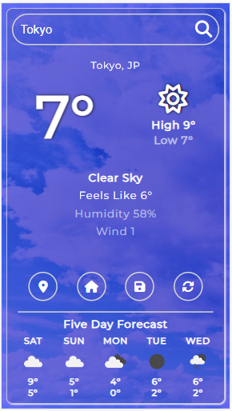
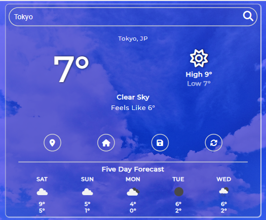

# Weather App

## Overview

This repository contains a weather application designed for convenient weather forecasting. The app allows users to check the weather forecast based on their current location, set a home location for quick reference, search for weather information by entering city names, countries, or ZIP codes, and update the data as needed. Additionally, a 5-day forecast is provided at the bottom of the interface for future planning.

## Features

### 1. Current Location Forecast
- Users can easily obtain the current weather forecast based on their device's location.

### 2. Home Location
- Set and save a home location for quick and easy access to local weather information.

### 3. Search Functionality
- Search for weather updates by entering the name of a city, country, or ZIP code in the search bar.

### 4. Data Refresh
- Keep weather information up-to-date by refreshing the data within the application.

### 5. 5-Day Forecast
- View a forecast for the next five days to plan ahead.

  ## Screenshots

### Desktop

### Phone

  

### Tablet

  

## Backgrounds

### Night

### Rainy Day

### Snowy Day

## Usage

To use the application, follow these steps:

1. **Current Location Forecast**
   - Upon launching the app, the current weather for the user's location will be displayed.

2. **Setting Home Location**
   - Use the designated option to set a home location for quick access to local weather.

3. **Searching for Weather**
   - Enter the desired location in the search bar to retrieve the weather information for that area.

4. **Data Refresh**
   - Keep the weather data up-to-date by using the refresh option.

5. **5-Day Forecast**
   - Scroll down to view the 5-day forecast for future weather planning.
